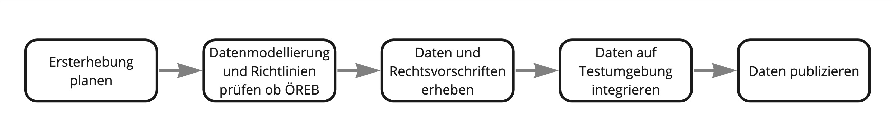

== Vorwort 
In diesem Benutzerhandbuch wird dokumentiert, wie der Kataster der öffentlich-rechtlichen Eigentumsbeschränkungen (ÖREB-Kataster) im Kanton Schwyz aufgebaut ist.

https://map.geo.sz.ch/s/tR6Lk5[Startseite des ÖREB-Katasters im Kanton Schwyz]

.Es soll für den ÖREB-Kataster dargelegt werden:
* auf welchen Rechtsgrundlagen er beruht; 
* wer dafür zuständig ist; 
* wie er technisch aufgebaut ist; 
* wie der Betrieb organisiert ist; 
* wie die Daten verarbeitet und nachgeführt werden sollen.

Die Daten des ÖREB-Katasters bestehen aus Geodaten, Geometadaten, den Datenmodellen für die Geodaten und die rechtlichen Grundlagen, anhand derer die Geodaten erfasst wurden. Die Nachführung der einzelnen Themen im ÖREB-Kataster richtet sich nach der rechtlichen Grundlage und danach, ob eine Änderung eine rechtliche Vorwirkung entfacht. 

== Organisation
=== Rechtsgrundlagen 
Der ÖREB-Kataster ist ein gemeinsames Projekt von Bund und Kantonen.

.Die gesetzlichen Grundlagen auf Bundesebene sind folgende:
* Bundesgesetz über Geoinformation vom 5. Oktober 2007 (GeoIG, SR510.62); 
* Verordnung über Geoinformation vom 21. Mai 2008 (GeoIV, SR510.620); 
* Verordnung über den Kataster der öffentlich-rechtlichen Eigentumsbeschränkungen vom 2. September 2009 (ÖREBKV, SR510.622.4).

.Auf kantonaler Ebene sind folgende Regelungen relevant:
* Kantonales Geoinformationsgesetz vom 24. Juni 2010 (KGeoiG, SRSZ214.110); 
* Verordnung zu kantonalen Geoinformationsgesetzt vom 18. Dezember 2012 (KGeoiV, SRSZ214.111); 
* Verordnung über den Kataster der öffentlich-rechtlichen Eigentumsbeschränkungen vom 19. September 2017 (KÖREBKV, SRSZ214.113).

Durch die Swisstopo wurden zudem verschiedene Weisungen erstellt, damit der ÖREB-Kataster schweizweit einheitlich erscheint. Die aktuellen Weisungen sind auf der Webseite https://www.cadastre-manual.admin.ch/de/oereb-weisungen-oereb-kataster[] abrufbar:

.Strategisch
* «Strategie für den Kataster der öffentlich-rechtlichen Eigentumsbeschränkungen (ÖREB-Kataster) für die Jahre 2020–2023» gültig ab 1. Januar 2020 für vier Jahre. 
* «Strategie für den Kataster der öffentlich-rechtlichen Eigentumsbeschränkungen (ÖREB-Kataster) für die Jahre 2020–2023: Massnamenplan» gültig ab 1. Januar 2020 für vier Jahre. +

.Inhaltlich und technisch
* «ÖREB-Kataster: Rechtsvorschriften, gesetzliche Grundlagen und Zusatzinformationen» vom 1. August 2021 (Stand am 15. März 2023). 
* «ÖREB-Kataster: Inhalt und Darstellung des statischen Auszugs» vom 1. November 2017 (Stand am 25. August 2022). 
* «ÖREB-Kataster: DATA-Extract» vom 1. November 2017 (Stand am 25. August 2022). 
* «ÖREB-Kataster: ÖREB-Webservice (Aufruf eines Auszugs) vom 1. November 2017 (Stand am 25. August 2022). 
* «Rahmenmodell für den ÖREB-Kataster: Erläuterungen für die Umsetzung» vom 1. Februar 2011 (Stand am 25. August 2022). 

=== Katasterverantwortliche Stelle (KVS)
Das Amt für Geoinformation (AGI) wurde vom Regierungsrat zur katasterverantwortlichen Stelle bestimmt. Zu den Aufgaben der KVS gehören die Integration der Daten in den Kataster, welche von den zuständigen Stellen an das AGI weitergegeben werden. Zudem werden die gesetzlichen Grundlagen mit den Geodaten im Auftrag der zuständigen Stelle verknüpft. Die Inhalte des Katsterns sind als statischer und dynamischer Auszug im WebGIS abrufbar.

=== Zuständige Stelle für die Bereitstellung der Daten
Im ÖREB-Kataster werden verschiedene ÖREB (Themen) abgebildet. Für die verschiedenen Themen sind unterschiedliche Amtsstellen zuständig. Die Details dazu können dem Anhang der KGeoiV entnommen werden. Die zuständigen Amtsstellen müssen in den Einführungs- und Nachführungsprozess eingebunden werden.

=== Staatskanzlei
Die Änderungen in den gesetzlichen Grundlagen meldet die Staatskanzlei der katasterverantwortlichen Stelle. Die KVS verwaltet wiederum für die Staatskanzlei die gesetzlichen Grundlagen im Rahmenmodell.

== Systemumgebung
=== Architektur
Die ÖREB-Kataster-Infrastruktur ist aus unterschiedlichen Modulen zusammengesetzt. Die Module wurden von verschiedenen Herstellern entwickelt. Soweit möglich werden Open-Source-Komponenten eingesetzt.

.ÖREB Architektur (ÖREB-Daten und Fachdaten im WebGIS)

=== Komponenten
==== ÖREBlex
Die Dokumentenverwaltung ist in die Komponenten ÖREBlex und Schnittstellen LexWork/LexFind untergliedert. Über ÖREBlex verwaltet die KVS alle Entscheide (Rechtsvorschriften) der kantonalen und kommunalen Themen. Die Erlasse (gesetzliche Grundlagen) hingegen werden über die zusätzlich beschaffte „Schnittstelle LexWork/LexFind“ automatisch integriert. Die Erlasse auf Stufe Bund werden durch die Bundeskanzlei und jene auf Stufe Kanton durch die Staatskanzlei in LexFind erfasst. Die Beziehung zwischen einer Eigentumsbeschränkung und ihren Dokumenten geschieht über den so genannten Geolink. 

==== ÖREB-Server
Für die Funktionen des ÖREB-Katasters wird pyramid_oereb verwendet. Dies ist eine Softwarekomponente, die von rund 12 Kantonen gemeinsam entwickelt wird. Sie dient als ÖREB-Server. Diese zentrale Komponente verbindet die Grundstücksdaten mit den Daten mit Eigentumsbeschränkungen und mit den Daten über die rechtlichen Grundlagen. Daraus kann für jedes Grundstück die Information zu den ÖREB erstellt werden. Die Information wird als PDF angezeigt und lässt sich über MapFish Print drucken.

==== ÖREB-Server Print
Der ÖREB-Server Print (pyramid_oereb_mfp) ist eine Erweiterung des ÖREB-Servers (pyramid_oereb), die es ermöglicht, statische Auszüge im PDF-Format zu generieren. Diese Implementierung basiert auf MapFish-Print und erfordert die Installation von MapFish-Print, Java und das Hinzufügen von Schriftarten für den Druck.

==== ÖREB-Datenbank
In der geoportal PostGIS Datenbank werden die Schemata der jeweiligen ÖREB-Themen geführt. 
Die Datenstruktur entspricht einem mit ili2pg angelegten Schema und Tabellen. Für die Bereitstellung der Geowebdienste (WMS, WFS) werden zusätzlche Views angelegt.

==== WebGIS (GeoMapFish)
Im Kanton Schwyz wurde der ÖREB-Kataster ins WebGIS eingebaut. Damit dient GeoMapFish zusammen mit einem graphikfähigen Browser als Benutzeroberfläche und Datenviewer. Sämtliche Daten aus dem WebGIS können zusammen mit den ÖREB-Daten dargestellt werden.

==== Geodaten
ÖREB existieren auf den verschiedenen föderalen Ebenen (Bund, Kanton, Gemeinden). Die Geodaten dazu müssen je nach Ebene unterschiedlich behandelt werden:

* Geodaten vom Bund können zentral über data.geo.admin.ch bezogen und ins System eingebunden werden.  
* Geodaten vom Kanton werden von der zuständigen kantonalen Fachstelle aufbereitet. Bevor sie publiziert werden, müssen die Daten auf Vollständigkeit und Konsistenz geprüft werden. data.geo.sz.ch
* Geodaten der Gemeinden müssen erst zusammengeführt und bereinigt werden. Man spricht von Datenintegration. Allfällige Lücken oder Überlagerungen in den Daten müssen behoben werden. Dies kann in der Regel nicht vollständig zentral erfolgen. data.geo.sz.ch

== Durchführung und Überwachung des Betriebs
=== Entwicklungs-, Test- und Produktionssystem
Die gesamte Infrastruktur steht dreifach zur Verfügung. Einmal auf einem Entwicklungssystem (dev), dann auf einem Testsystem (tst) und auf einem Produktionssystem (prod). Bevor neue oder geänderte Funktionen und Daten auf dem Produktionssystem veröffentlicht werden, werden diese auf das Testsystem aufgespielt und dort getestet. Das Entwicklungssystem dient zum Ausprobieren neuer Funktionen. 

Geplante Arbeiten an den Systemen werden mittels eines Trello-Boards überwacht. In den einzelnen Aufgaben, die auf dem Trello-Board festgehalten wurden, werden die Aktivitäten kommentiert. 

Änderungen und Neuerungen im produktiven System werden über einen Newsletter per E-Mail interessierten Dritten mitgeteilt.

=== Betriebsüberwachung mit Monitoring, Alarmierung 
Die Überwachung des Betriebs des ÖREB-Katasters geschieht auf unterschiedlichen Stufen. Auf tiefster Stufe, die Kontrolle der Funktionstüchtigkeit der Webserver, erfolgt durch Monitoringprozesse bei Camptocamp. Die Überwachung der Integrationsprozesse erfolgt durch die katasterverantwortliche Stelle. Sie kontrolliert die Jobs, und wird informiert, wenn Bundesdaten aktualisiert wurden. Allfällige Probleme beim Zugreifen durch Dritte auf den ÖREB-Kataster bzw. die KGDI bei internem gut durchlaufenden Betrieb werden von Dritten z.B. über die Service-Hotline oder per E-Mail gemeldet und schnellstmöglich bearbeitet.

=== Datensicherung
Die Geobasisdaten der kantonalen ÖREB-Themen sind in der kantonalen Geodateninfrastruktur (GDI) abgelegt. Die Datenintegration in den ÖREB-Kataster erfolgt mittels dem Rahmenmodell. Di Dadurch werden die Daten jeweils täglich durch das Amt für Informatik (AFI) SZ gesichert. Die Sicherung der Daten für den Kataster der Belasteten Standorte erfolgt durch die Firma geops. Die Inhalte des Rechtsinformationssystems ÖREBlex werden durch die Firma Sitrox AG, Zürich, gewartet und gesichert. Die Infrastruktur des WebGIS SZ wird durch die Firma Camptocamp gewartet und gesichert.

=== Kontrollen zum Datenschutz 
Die Geobasisdaten der ÖREB-Themen enthalten nicht-sensitive Sachdaten und unterliegen deshalb nicht dem Datenschutz. Die Rechtsvorschriften werden ohne sensible Daten publiziert. Die entsprechende Bearbeitung der Rechtsvorschriften liegt in der Verantwortung der zuständigen Stelle (§ 4 Abs. 1 KÖREBKV). Der Grundstücksbeschrieb der amtlichen Vermessung enthält die öffentlichen Eigentümerdaten. Diese Daten werden nur im dynamischen Auszug angezeigt. Der Datenschützer des Kantons Schwyz wurde bei der Erstellung des ÖREB-Katasters einbezogen.

=== Statistiken, Kennzahlen, Messgrössen
Die Zugriffe auf den ÖREB-Kataster werden geloggt und können in Abhängigkeit von Zeit und Thema mit Hilfe von Python, FME und Excel ausgewertet werden. Diese Zahlen sind auch die Kennzahlen für den jährlichen kantonalen Bericht und dienen der Katasteraufsicht und dem Kantonsrat als Berichtsinstrument.

=== Vorgehen im Fehlerfall
Fehler in den Geobasisdaten und Rechtsvorschriften, welche der katasteverantwortlichen Stelle  gemeldet werden, werden dem zuständigen Datenherrn zur Korrektur gemeldet. Die Fehler sind je nach Art so schnell wie möglich zu beheben. Dabei gilt die Frist von 20 Tagen gemäss § 6 Abs. 2 KÖREBKV.

== Ausfall des Betriebs und der Dienste
=== Ausfall und Wiederherstellung System/Betrieb ÖREB-Kataster
Während den Bürozeiten gibt es eine ordentliche Wiederherstellung (Reboot) in wenigen Minuten nach Eingang der Meldung. Der Reboot des Datenbank- und des Applikationsdienstes wird durch die Mitarbeiter des AGI durchgeführt.

=== Ausfall und Wiederherstellung Dienste 
In einem solchen Fall läuft der interne Standardprozess ab. Mitarbeiter des AGI werden die Fehlerursache eruieren und das Problem beheben. Bei Ausfall von Diensten mit Zugriff auf die ÖREB-Daten des Bundes, ist die Behebung der Ursache beim Bund abzuwarten.

=== Ablauf für die Wiederinbetriebnahme
Vor der Inbetriebnahme eines unterbrochenen oder ausgefallenen Betriebes werden die Inhalte und Funktionalitäten des WebGIS SZ auf einer Testumgebung geprüft. Bei den Diensten zu den Bundesdaten wird deren erneute Verfügbarkeit beim Bund nachgefragt.

=== Qualitätssicherung nach Wiederinbetriebnahme 
Die katasterverantwortliche Stelle führt Stichproben durch, welche die korrekte Wiederinbetriebnahme sicherstellt. Bei den Diensten zu den Bundesdaten geht man davon aus, dass die Dienste und Bundesdaten durch den Bund geprüft werden.

=== Erstellung und Wiedereinspielung Backups
Je nach Ereignis werden einzelne Datensätze, Themen oder die ganze Datenbank zurückgespielt. Die Backups der ÖREB-Daten, abgelegt auf dem Laufwerk Q der kantonalen Verwaltung werden durch das Amt für Informatik täglich und wöchentlich durchgeführt. Die Rechtsvorschriften im ÖREBlex sind durch die Firma Sitrox und die Funktionalitäten des WebGIS durch die Firma CamptoCamp betreut und gesichert. Das Einspielen eines Backups geschieht nach den Vorgaben interner Abläufe. Mitarbeiter des AGI treten dabei in Kontakt mit den Verantwortlichen der Infrastruktur und beauftragen diese mit dem Einspielen eines Backups.

== Datenverarbeitung
=== Erstaufnahme der ÖREB-Katasterdaten
.Erstaufnahme der ÖREB-Katasterdaten

. Die KVS nimmt mit der zuständigen Amtstelle Kontakt auf. Es geht darum abzuklären, in welcher Form die Daten vorliegen und wie sie allenfalls erhoben werden müssen.
. Die KVS legt zusammen mit der zuständigen Amtsstelle das Datenmodell fest. Das Modell basiert auf dem aktuellen MGDM und dem ÖREB-Datenmodell. Weiter legt die KVS zusammen mit der zuständigen Amtsstelle fest, wie die Daten erhoben, ins richtige Datenmodell transformiert und validiert werden können. Zudem wird gemeinsam ein Darstellungsmodell für die Geodaten festgelegt, das den ÖREB-Weisungen der Swisstopo entspricht. 
. Die Geodaten und die Rechtsvorschriften müssen unter Federführung der zuständigen Amtsstelle zusammengetragen werden. Die KVS begleitet die zuständige Amtsstelle bei dieser Arbeit. Die Daten müssen auf Korrektheit und Vollständigkeit geprüft werden.
. Die Geodaten werden im Testsystem aufgesetzt und nochmals geprüft. Die Geometadaten werden vorbereitet.  
Die zuständige Stelle bestätigt bei der Datenabgabe der KVS, dass die Daten gemäss dem gesetzlich vorgeschriebenen Verfahren beschlossen und genehmigt wurden und dass sie in Kraft sind. Wenn keine rechtsverbindlichen Daten existieren, werden Daten in den ÖREB-Kataster aufgenommen, die auf einem rechtsverbindlichen Plan beruhen. Die KVS legt in diesem Fall mit der zuständigen Stelle fest, wie die Rechtsverbindlichkeit der Daten erzeugt werden kann.
. Bevor die Daten auf das Produktivsystem übertragen und öffentlich aufgeschaltet werden, werden sie nochmals geprüft. Unvollständige oder fehlerhafte Daten werden nicht aufgeschaltet. Mit der Aufschaltung werden die Geometadaten aktualisiert.

=== Datenverwaltung
Die Verwaltung der Geodaten erfolgt innerhalb der Struktur der kantonalen Geodateninfrastruktur. Die Rechtsdokumente werden mit OEREBlex nur über Links verknüpft. Verwaltet werden sie im Projekt LexFind.

=== Nachführung der Datenmodelle
Eine Nachführung des Datenmodells wird etwa bei der Änderung des Rahmenmodells des Bundes notwendig. In diesem Falls unterstützt die KVS bei der Transformation der bestehenden Daten ins neue Datenmodell. Nach Möglichkeit werden automatisierte Prozesse, z. B. mit FME verwendet.

=== Nachführung des Darstellungsmodells
Bei der Nachführung des Darstellungsmodells berät die KVS die zuständige Amtsstelle. Es wird insbesondere auf kartographische Besonderheiten hingewiesen. Zusätzlich werden die Rahmenbedingungen des Bundes berücksichtigt.

Die neue Darstellung wird zuerst auf dem Testsystem geprüft. Nur bei erfolgreicher Prüfung wird das neue Datenmodell auf das Produktivsystem übernommen.

=== Nachführung der ÖREB-Daten im Allgemeinen
==== Generelles Vorgehen

.gerelles Vorgehen beim Nachführungsprozess

Eine Nachführung der Geodaten kann ereignisbezogen ausgelöst werden oder periodisch erfolgen. In beiden Fällen löst die zuständige Amtsstelle die Nachführung aus. Sie liefert der KVS den Änderungsdatensatz. Die KVS nimmt die Daten entgegen, registriert und prüft sie. Geprüft werden Datenkonsistenz und Modellkonformität. Wenn die Daten Fehler aufweisen, müssen sie durch die zuständige Stelle bereinigt werden.

Die geänderten Geodaten werden in jedem Fall vor der Veröffentlichung auf dem Testsystem nochmals geprüft. Die Geometadaten werden für die Publikation vorbereitet.

Der detaillierte Ablauf der Nachführung unterscheidet sich für Geodaten mit und ohne öffentlicher Auflage. 

==== Geodaten ohne öffentliche Auflage
.In den folgenden Fällen entfällt eine öffentliche Auflage:
* Die Geodaten unterstehen keiner öffentlichen Auflage.  
* Es ändert sich nur das Geodatenmodell. Die Geodaten bleiben inhaltlich gleich.
* Es ändert sich nur das Darstellungsmodell. Die Geodaten bleiben inhaltlich gleich. 
* Es erfolgt nur eine «Kanzleiänderung» an den Geodaten. Die Änderung an den Geodaten ist nur redaktioneller Art oder formlos. Rechtlich bleiben die Geodaten unverändert.
* Es erfolgt nur eine geringfügige Korrektur, die durch den Regierungsrat genehmigt werden darf. 

In diesem Fall werden die Änderungen auf dem Testsystem vorbereitet und geprüft. Bei erfolgreicher Prüfung können sie auf dem produktiven System aufgeschaltet werden. Allenfalls erfolgt die Aufschaltung auf dem produktiven System zu einem bestimmten Termin, etwa wenn die Änderung mittels Regierungsratsbeschluss in Kraft gesetzt wird.

==== Geodaten mit öffentlicher Auflage
. Die Auflage wird auf dem Testsystem geprüft und zu einem bestimmten Termin auf dem produktiven System aufgeschaltet. 
. Auf dem Testsystem wird das Ende der Auflage vorbereitet und zu einem bestimmten Termin auf dem produktiven System aufgeschaltet. Es stehen sowohl der rechtsverbindliche als auch der geplante Zustand zur Verfügung. 
. Wenn die Auflagefrist abgeschlossen ist, wird angezeigt, ob es Einsprachen zur Änderung gibt, ob diese noch behandelt werden, ob es Rekurse zu den Einsprachen gibt. Die zuständige Stelle informiert jeweils die KVS über Statusänderungen. 
. Das Inkrafttreten der Änderung wird auf dem Testsystem vorbereitet und zu einem bestimmten Zeitpunkt auf dem produktiven System aufgeschaltet. Falls die Änderung nicht genehmigt wird, wird diese vom produktiven System entfernt.

Die folgende Graphik zeigt ein Beispiel für den Prozessablauf bei Daten mit öffentlicher Auflage. Das Beispiel zeigt den Ablauf, bei einer kompletten Genehmigung oder kompletten Ablehnung der Änderungen.

Bei einer Teilgenehmigung werden die Daten in den genehmigten und den nichtgenehmigten Teil geteilt. Die einzelnen Teile durchlaufen dann separiert den Nachführungsprozess. Es können verschiedene Nachführungsprozesse gleichzeitig ablaufen. 

Während der öffentliche Auflage und nach der öffentlichen Auflage bis zur Beschlussfassung gibt es zwei Datenstände: einmal den rechtskräftigen Zustand und einmal den geplanten Zustand. 

=== Nachführung einzelner Themen
==== Themen des Bundes
Die Themen vom Bund werden als Dienst in den ÖREB-Kataster eingebunden. Sofern sich der Dienst nicht ändert, sind keine Aktivitäten seitens der KVS notwendig.

.Dies betrifft folgende Themen:
* Projektierungszonen Nationalstrassen (ID 87) 
* Baulinien Nationalstrassen (ID 88) 
* Projektierungszonen Eisenbahnanlagen (ID 96)
* Baulinien Eisenbahnanlagen (ID 97)
* Projektierungszonen Flughafenanlagen (ID 103)
* Baulinien Flughafenanlagen (ID 104) 
* Sicherheitszonenplan (ID 108)
* Kataster der belasteten Standorte des Militärs (ID 117)
* Kataster der belasteten Standorte im Bereich der zivilen Flugplätze (ID 118) 
* Kataster der belasteten Standorte im Bereich des öffentlichen Verkehrs (ID 119)
* Projektierungszonen Leitungen mit einer Nennspannung von 220 kV oder höher (ID 217)
* Baulinien Starkstromanlagen (ID 218)

==== Nutzungsplanung (ID 73) 
* Nutzungsplanung kantonal (Siedlung) (ID 73) 
* Nutzungsplanung kantonal (Strassen) (ID 73B)
* Nutzungsplanung kantonal (Natur- und Heimatschutz) (ID 73C) 
* Nutzungsplanung kommunal (ID 73D)

.Nachführungsprozess ist in Ausarbeitung (im Miro Board dokumentiert):
https://miro.com/app/board/o9J_lu8t5yE=/?moveToWidget=3458764518174132813&cot=14[Miro-Board: Nachführungsprozess]

==== Planungszonen (ID 76)
* Planungszonen kantonal (Siedlung) (ID 76A)
* Planungszonen kantonal (Strassen) (ID 76B) 
* Planungszonen kantonal (Natur- und Heimatschutz) (ID 76C) 
* Planungszonen kommunal (ID 76D)

Die Festlegung erfolgt durch das Departement. In diesen Gebieten darf nicht unternommen werden, was die Nutzungplanung erschwert (eine Vorwirkung entfacht). Die Planungszonen erlöschen i. d. R. nach drei Jahren, spätenstens nach fünf Jahren. Es bestehen Einsprache- und Beschwerdemöglichkeiten.

==== Kataster der belasteten Standorte (ID 116) 
Für das Thema besteht keine Auflagepflicht.  
Das Thema wird mit einem automatisierten Prozess täglich aktualisiert.

==== Grundwasserschutzzonen (ID 131)
Auflage (30 Tage), initiiert durch die Gemeinde. Einsprache- und Beschwerdemöglichkeit.
Durch die Beschwerde kann es zu einer Wiederholung der Auflage kommen. Aus Sicht der KVS wird dann die ursprüngliche Änderung verworfen und der Nachführungsprozess mit einer neuen Änderung neu gestartet.

==== Grundwasserschutzareale (ID 132)
. Anhörung verschiedener Beteiligter (Gemeinden, Wasserversorgung, Grundeigentümer).
. Auflage (30 Tage), initiiert durch den Kanton (AfU). Einsprache- und Beschwerdemöglichkeit.
. Departement setzt die Änderung als Verfügung in Kraft.
.. Diese kann juristisch während einer bestimmten Frist noch angefochten werden.
.. Die Frist kann abgelaufen sein, jedoch das juristische Verfahren noch hängig sein.

==== Lärmempfindlichkeitsstufen (ID 145)
Die Lärmempfindlichkeitsstufen werden als Teil der kommunalen Nutzungspläne genehmigt. 

==== Statische Waldgrenzen (ID 157)
Periodische Nachführung beim Erlass des Zonenplans, Nutzungsplans oder bei Baubewilligung, falls erforderlich. Individuelle Nachführung auf Gesuch hin.

. Stellungnahme bei Gemeinderäten. 
. Auflageverfahren (30 Tage) mit Einsprache während der Auflage. 

==== Waldabstandslinien (ID 159)
Der Waldabstand wird aus den Waldgrenzen bestimmt. Die Festlegung erfolgt gemeinsam mit dem Verfahren zur statischen Waldgrenzen.

==== Waldreservate (ID 160)
. Einbeziehung der Öffentlichkeit bei der Planung 
. Öffentliche Auflage (30 Tage) mit der Möglichkeit zur Stellungnahme.
. Erlass durch den Regierungsrat.

==== Gewässerraum (ID 190)
. Gewässerraum (allgemein) (ID 190A) 
. Gewässerraum in kantonalen Nutzungsplänen (Natur- und Heimatschutz) (ID 190B) 
. Gewässerraum in kantonalen Nutzungsplänen (Siedlung) (ID 190C) 
. Gewässerraum in kantonalen Nutzungsplänen (Strassen) (ID 190D)

Die Nachführung des Gewässerraums erfolgt mit der Nachführung der Nutzungsplanung.

=== Nachführung der kantonalen Fachgesetzgebung
LexFind bezieht die Gesetze und Verordnungen direkt von der Staatskanzlei. Die Daten werden täglich aktualisiert. Damit sind die verlinkten Gesetze immer aktuell.

Die zuständige Stelle kontaktiert die KVS, falls eine Änderung es notwendig macht, dass sich die Verlinkung ändert. In diesem Fall wird gleichzeitig geprüft, ob eine Nachführung der Geodaten notwendig ist.

== Supportorganisation 
=== National
Der Bund unterstützt während der Einführung des ÖREB-Katasters mit einer Supportorganisation die Koordination und den Informationsaustausch zwischen den Kantonen und dem Bund.

* Jährliche Informationstagungen „ÖREB-Kataster“ 
* Arbeitsgruppen 
* Supportgruppen 
* Schwergewichtsprojekte

=== Kantonal
Die katasterverantwortliche Stelle, das AGI, unterstützt die betroffenen Fachstellen aktiv bei der Umsetzung des Datenmodells und der Erhebung der Daten und Rechtsvorschriften.

== Changemanagement
=== National 
Änderungen im Aufbau des ÖREB-Katasters – z.B. Anpassungen im Rahmenmodell, Ergänzungen in Weisungen, Anpassung ÖREBKV, usw. – werden durch den Bund initialisiert. Bei geänderten Weisungen werden die Kantone durch den Bund über deren Inkrafttreten informiert. Neue ÖREB-Themen und Änderungen in der ÖREBKV werden zuerst durch paritätisch zusammengestellte Arbeitsgruppen (abhängig vom Thema und beteiligten Stellen) erarbeitet. Danach erhalten die Kantone die Unterlagen zur Stellungnahme.

=== Kantonal
Die beteiligten Fachstellen melden ihre Erfahrungen bei der Umsetzung und Bedürfnisse dem AGI. Optimierungen im Datenmodell werden so rasch als möglich umgesetzt, insbesondere bei den Themen den kantonalen zuständigen Stellen. Die Erfahrungen der kantonalen Stellen für die weiteren ÖREB-Themen werden gesammelt und dann in definitive Richtlinien umgesetzt.

ifdef::backend-pdf[]
<<<
endif::[]